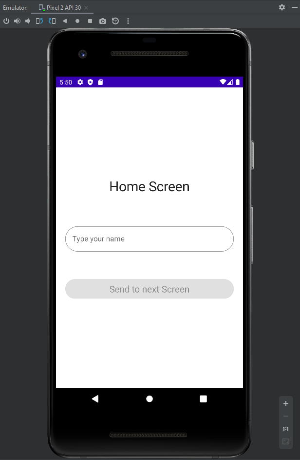
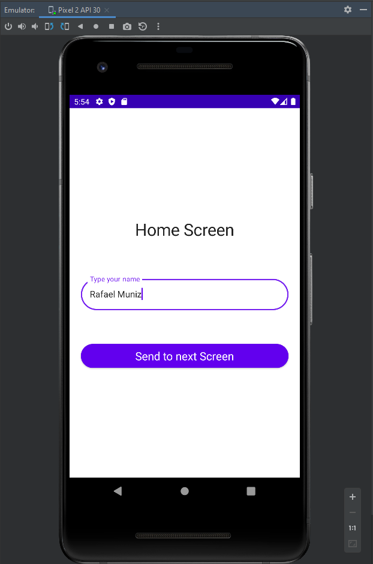
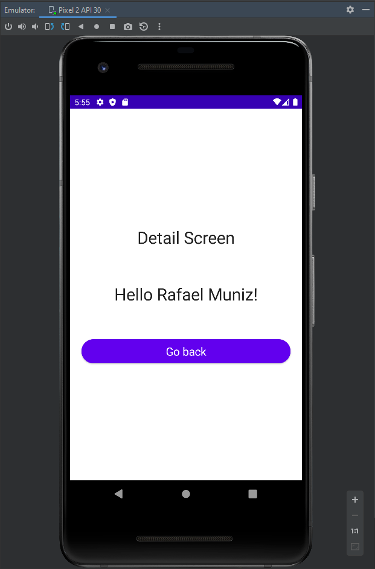

# Testing Jetpack Compose
 

- Simple example of testing in Jetpack Compose;
- The app has two screens:
  1. The first one has a text describing which screen is,\
   an input that expect some text and a button which enables\
   when you input text in the field above;

    

   
   
   
    

  2. The second screen has two texts\
   the first text describes which screen is\
   the second text returns the first screen's input\
   and a button to go back to First Screen;
   
    

   

    

   ---
   # Run tests
    

  - Go to `androidTest/screen` directory, open the `HomeScreenTest.kt` Class and click to run it.

    

   ---
   # Contact
    

   - Conect or follow me on [LinkeIn](https://www.linkedin.com/in/rafael-muniz-vieira-b4239751/) for more.
   - Please leave comments, thoughts and ask questions about.

     

    ---
    # How to find elements on Native Testing Jetpack Compose apps
     

    - Look my [LinkedIn article](https://www.linkedin.com/pulse/how-find-elements-testing-jetpack-compose-apps-rafael-muniz-vieira/?published=t&trackingId=t%2Fv98qCA%2BlU527ymEl3YWA%3D%3D).